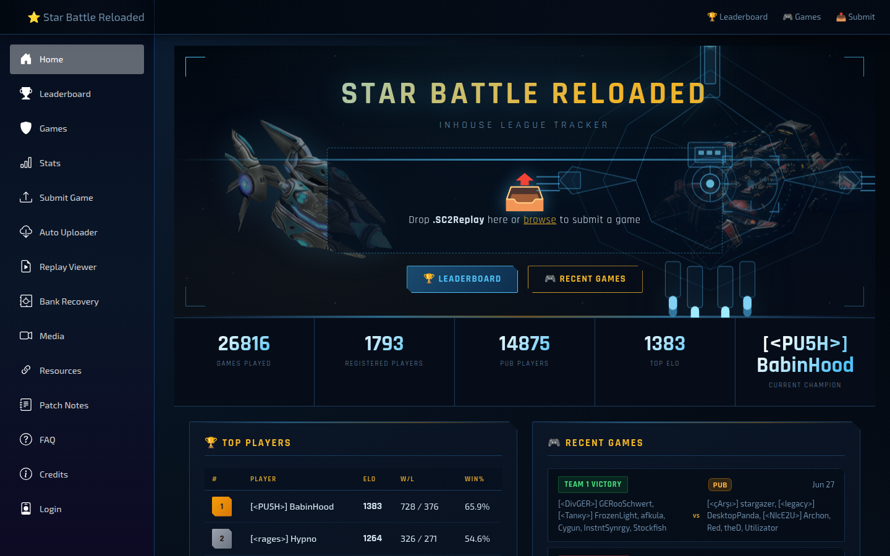
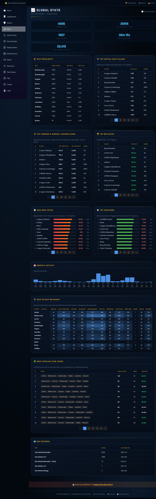
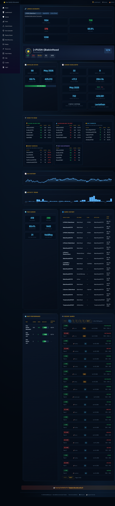
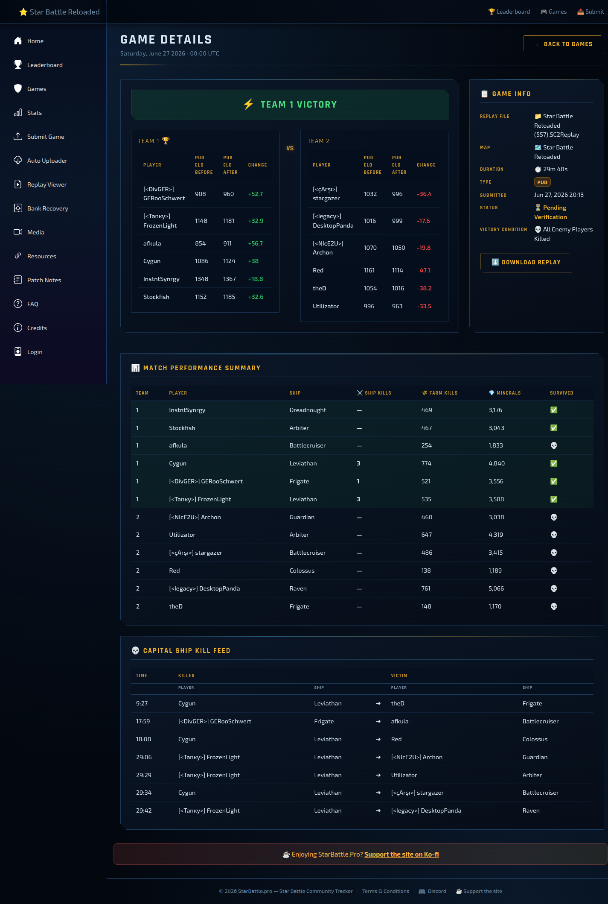
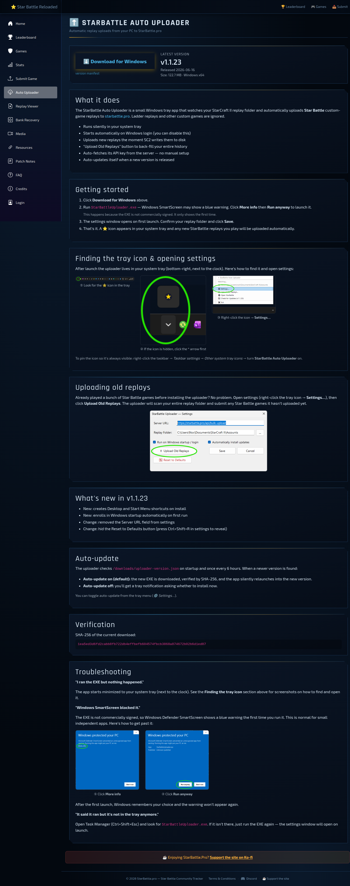

# Star Battle Reloaded 5.0 - Patch Notes

- [__TODO__] Look into adding some of the recent maps

## Map editor

- Reintroduced basic starmap editor - allowing to edit and expand the pool of existing battle maps.

[See more on YT](https://www.youtube.com/watch?v=wO1D8iv6iFw)

> More features will be added in the future..

## Ships & Balance

- Queen reintroduced.

> Queen still requires more thought, not just testing. Abilities such as:
> - Symbiote 
> - Infestation
>
> Aren't considered to be complete - likely still flawed on both angles. But hopefully good enough to postpone
>
> Other avenues are "done" on the design aspect, but the exact way of implementation leaves a lot of room for improvements/changes.
>
> "Done" means I hope it's good enough for now, but I bet this is not a final iteration and I expect it might require a lot of revisions before things are in place.

### Queen

- Added missing blood FX when ship is crit/heavy/light damaged.
- Added first set of achievements for playing Queen ("Casual Play" category).
- Neural Parasite:
  - It's now a projectile driven ability - it needs time to arrive at the impact point.
  - Affected ships now require extra 2s for effect to complete, and fight for the Queen.
  - Affected ships can no longer use the shield.
    > This is mostly aimed at upgraded Carrier's interceptors
  - Duration increased from 20s to 25s.
  - Improved interactions with following units:
    - Interceptors can be box-selected.
    - Scourges will no longer suicide, instead they'll turn back, attacking nearest capital ship they'll see unfriendly.
    - Siege fighters & Broodlords will initially waypoint back to the other base.
    - Observer & spotter will initially follow the Queen.
    - Other units will initially a-move to the Queen.
- Infestation:
  - Can now be casted on non mechanical units - all zerg capital ships, including Queen itself.
  - Infestation cooldown ultimate 30s -> 45s
  - Fixed an issue where Queen's Infestation tentacle would remain floating in the space whenever it failed to connect with the target.
- Blinding Cloud:
  - It's now larger, and no longer a perfect circle, but an oval, that stretches to the sides in relation to the direction it was thrown.
  - It no longer limits the vision of the ships that are inside, but also blocks the line of sight of the approaching ships, similarly as Gas Clouds do.
  - Reduced effect radius
- Parasitic Bomb:
  - Reduced damage vs. Massive from 1350 to 1200
  - Removed target acquisition in response to the Parasitic Bomb damage, that would draw aggression to the Queen, from affected units and the ones which were nearby (in response to `CallForHelp`).
- Ensnare:
  - Upon impact effect stays on the battlefield for 1s before expiring (akin to Arbiter's storm), instead of one-time hit-scan like behavior.
- Fixed an issue where Blinding Cloud effect would persist, if player's ship was killed while cloud's effect was still active.
- Fixed an issue where Blinding Cloud wouldn't de-buff Overlord's Antennae.
- Fixed an issue where Infestation would not be immune to Dreadnought's Cover.
- Fixed an issue where Infestation wouldn't correctly mark player's ship as killed, by a result game couldn't be won until enemy base has been destroyed.
- Fixed an issue where Infested ship wouldn't have its minimap icon.

### Battlecruiser

- Mini Yamato Gun:
  - Reduced damage from 1200 to 900
  - Reduced price from 200 to 175
  - Changed weapon target acquisition mechanic to allow manual manual targeting.
- Defensive Shield:
  - Removed bonus to hull regenaration from the upgrade (was +5 for each level).
  - Doubled bonus to shields regenaration from 25 to 50 per upgrade level.
- Fixed Lockdown to no longer disable ability to launch & retarget OBF and Escort Fighters (Carrier's Scouts).

### Dreadnought

- Increase base armor to 15.
- Reduce armor per upgrade to +4.
- Decrease sieging/unsieging time to 4 seconds.
- Increase siege speed to 25%.
- Enable gatlings while sieged.
- Decrease siege damage to 100 (+300 vs massive) + 10 (+30 vs massive) per upgrade.
- Reduce Reinforced Hull damage reduction to 30%.
- Lockdown now should turn off cover and disable it.
- Add a new upgrade – Gauss Cannon – increases siege damage. Gatling upgrades no longer increase siege damage or attack speed.
- Gatlings upgrades no longer increase Gatlings attack speed.
- Fixed an issue where Cover could repeatedly attempting to redirect the same projectile. Combined with the slow down of speed for first ~0.5 second upon redirect, it could cause weird glitches, especially noticeable with chasing projectiles (i.e. Raven's Seeker, BC's Nuke).
- Fixed an issue where Cover would remain active when trapped in Arbiter's Stasis Field.

### Frigate

- Adjust magnetic mines damage to 550 (+55 per upgrade).
- Fixed range upgrade to actually increase launch/retarget of wraiths per 1.25 per level (instead of 1), as it was intended and written in the tooltip.
- Fixed inaccurate tooltip on Wraith upgrade mentioning increased damage by +0.5 to massive, where it was actually +1.

### VoidRay

- Remove phase shift scaling from shield upgrades-
- Remove damage reduction from armor.-
- Energy Nova:
  - Increase its damage to 125(+1275 vs massive)
  - Remove shield and energy leech.
  - Remove scaling from lasers.
  - Reduce nova radius to 4.
  - Increase nova animation (after changing blasts from 3 to 1) by 50%.
  - Nova does its full damage in 1 blast (instead of 3).
  - Revert nova energy cost to 100. Reset its cooldown to 10s.

### Raven

- Enhanced systems:
  - Reduced EMP bonus range from 1.0 to 0.5.
  - Removed EMP bonus damage to shields.
  - Reduced bonus regeneration granted by enhanced systems.

### Colossus

- Increase field disruptor radius from 4 to 4.5.
- Increased base shield regeneration to 80.
- Reduce shield regeneration per upgrade from 10 to 8.

### Arbiter

- Force Field: Reduced cast range from 9 to 7

### Carrier

- Interceptors:
  - Increased move speed from 2.6 to 2.75
  - Removed shield regeneration delay reduction from capacity upgrades.
- Scouts:
  - Increased base damage from 40 to 50.
  - Reduced base hull and shield amount from 125 to 105.
- Tempests:
  - Increased amount of tempests Carrier can warp in from 4 to 6.
- Plasma Barrage:
  - Added a 1.5s casting time. Reduced period between individual barrage from 0.4s to 0.25s - making it to 2.5s.
  > Combined "cast time" remained effectively the same.
- Fixed an issue where it was possible to cast Vortex further than the intended 10 range, pushing it to a maximum of ~15.
- Fixed an issue where Warp In ability would be able to cooldown white under effect of BC' Lockdown.

### Leviathan

- Reduced the extra damage from corruption from to 33% to 25%.

### Guardian

- Increased Guardian starting speed from 1.3007 to 1.3507 (+0.05).
- Reduced Corruptor Acquire Leash Reset Radius (radius within which new targets may be acquired after chasing) from 9 to 4.
- Increased Acid Spore base damage from 160 to 180.
- Increased Broodlord acceleration from 0.1875 to 1.5.
- Increased Corruptor acceleration from 0.9375 to 1.5.
- Reduced Corruptor Acquire Leash Radius (maximum chase distance before returning to original position) from 19 to 6.
- Reduced Corruptor Acquire Leash Reset Radius (radius within which new targets may be acquired after chasing) from 9 to 4.
- Wild Mutations now grants detection in a 5-unit radius (for Guardian), +20% attack speed, and +10 sight range (to all affected units).

### Misc balance

- Reduced AI leash radius (21 → 18) and movement limit (21 → 18) — units return to their post sooner when chased.
- Increased leash reset radius (5 → 7) — units re-anchor further from their origin before giving chase again.
- Increased call-for-help radius (2 → 4) and period (2 → 4) — nearby units now respond to allies under attack from further away, more often.
  > Above adjustments were made in response to the introduction of the Queen.

## Bugfixes

- Fixed lack of spacing between teams on the leader board.
- Fixed an issue where if match completed prematurely ("You won the game." message at the end - without any points), it would count as a loss for the victorious team.
- Fixed an issue where changed settings (UI config, ship skins etc.) wouldn't be immediately saved into bank file (it required completing rated game, or changing settings prior to picking a ship).
- Fixed an issue where `Team Side` option in lobby settings wouldn't apply. (Or rather, it was only being considered in games where teams were automatically balanced - so completely opposite from how it was intended).
- Fixed na issue where `Map` chosen in lobby settings wouldn't align with what the game actually used. 
  > The list presented in lobby was off by 1 element, so when you were picking `C`, the game was loading `B` etc. - in that order, with the exception of "Ulnar" - it was the only one that did align.
- Fixed a rare issue related to "Squads" - in some scenarios (reaching 15 players within the lobby at least once during its lifetime + some other edge case criteria) the game would fail to initialize completely - no bases, no ships.
- Fixed an issue where rating of the teams wasn't calculated in games that used `Premade / IH` mode, and had teams preset in lobby (no FFA). Resulting in `+16 / -16`. (It was working correctly only when teams were balanced automatically by in-game systems).
  > Really surprised we caught it just now. Also, please double check if it was indeed fixed, as it was kind of a blind fix.

## Tournament

The [Star Battle Reloaded Tourney 2025](https://sites.google.com/view/starbattle2025/home) took place in April 2025 — the first SBR-era community tournament. 8 teams and ~80 players competed across three phases: Round Robin (April 4–11), Semifinals (April 12), and Finals (April 13).

### Results

| Place | Team | Tag |
|---|---|---|
| 1st | PUSH | [PU5H] |
| 2nd | Uprise | [Uprise] |
| 3rd | Aces Retadred | [AcesHi] |
| 4th | RedAlert | [RA] |
| 5th | NicE2U | [NIcE2U] |
| 6th | Intruder | [5ints] |
| 7th | Star Ally | [CNEF] |
| 8th | FRLNC | [FRLNC] |

PUSH won the Finals 3–1 against Uprise. Aces Retadred took 3rd place, winning 2–1 against RedAlert.

### Rewards

- **TF23 — "Battlecruiser Remastered"** (Battlecruiser skin) — exclusive cosmetic awarded to members of the winning team (PUSH).
- **RT1–RT3** — Tournament placement stars, awarded to top-3 teams. Counts toward the Champion chain (Elite Battlecruiser skin at 1 top placement, High Executor rank at 2).
- **RT4** — Tournament participation star, awarded to all remaining participants (4th place and below). Counts toward the Tournament Participant chain (Hero Void Ray skin, then Mentor / Master / Executor ranks at 2 / 3 / 5 participations).

### Organizers & Casters

- **Organizers:** Terry (MantisShrimp) and Abra
- **Map Creator & Trophy Award:** Talv
- **Casters:** [Abra](https://www.youtube.com/channel/UCxwU9kyuTiVg05PBxOSejSQ) (YouTube), [LuckyDevil](https://www.twitch.tv/lucky777devil) (Twitch), [Nox](https://www.twitch.tv/noxrts) (Twitch), Ice, Delta, Master, Terry

### Participants

- **PUSH** [PU5H] — Rosta, BabinHood, Madknight, ThePunisher, Damgood, TairyHesticl, Pringl
- **Uprise** [Uprise] — LionInCage, KraKen, Nox, Seb, DesktopPanda, GKR, Muse, Redstar, unox
- **Aces Retadred** [AcesHi] — Abra, PraetorAlex, BeggiIcE, Hacker, QQQ, GeneralX, RedDog, TheMaster, JihadJoe, DeltaNine
- **RedAlert** [RA] — BattleStar, sanek, Animosus, Ivanopala, Bio, Kidnaper, SanyaWhite, Veo
- **NicE2U** [NIcE2U] — YangWenli, PlanetNine, ccktuss, Dar, Archon, Coutinior, Palpatine, CoolBreeze, CoFFee
- **Intruder** [5ints] — LIUSUSU, yzc, loong, Kneecap, Diaoyudao, Orz, Ayanami
- **Star Ally** [CNEF] — starrynight, kevin, FXGFri, EFLAG, nebula, Roar, aslan, flongcslol, FreezeHeaven
- **FRLNC** [FRLNC] — jjbeast, RAW, AlmirantGrau, jimber, Thirteen, DeadlyKiller, AdmiralNova, LOLz, DarkCommand, Jan, Gyges

### Replays & Games

All 33 tournament matches are available on [starbattle.pro](https://starbattle.pro/games?filter=Tournament) — the community game tracker for Star Battle Reloaded. Each game entry includes match details (teams, players, duration, outcome) and replay files that can be viewed in the site's built-in [Replay Viewer](https://starbattle.pro/replay-viewer).

### Automated Reward Distribution

Tournament reward management has been streamlined — reward metadata is now generated automatically, and any community official on the dev team can update it without needing Talv to push every change. A manual step (publishing to Battle.net) is still required, but the process is far simpler than before.

The reward data is split into two eras:

- **Classic era** — all tournaments from the original Star Battle (pre-Reloaded). Placement stars (T1–T5) for 1634 players have been ported over and are preserved.
- **Reloaded era** — SBR tournaments going forward. Placement stars (RT1–RT4) and cosmetics like TF23 are granted based on your team's final standing.

Both eras are merged together, so whether you earned stars back in Classic or in the latest SBR tournament, everything shows up on your profile.

Any member of the dev team (Talv, LionInCage, Nox, Abra) can manage tournament rewards — this includes adding future tournaments, fixing missing or incorrect Classic-era stars, and granting cosmetics. That said, no promises we'll get to every request — but you might try asking Abra nicely.

The raw reward data (JSON) is publicly available:
- [Tournament Index](https://star-battle.talv.space/tournament/index.json) — list of all tracked tournaments.
- [SBR Tourney 2025](https://star-battle.talv.space/tournament/tournament-2025-04-01.json) — rosters, placements, and rewards for the 2025 tournament.
- [Player Rewards](https://star-battle.talv.space/tournament/player-rewards.json) — all player rewards across both eras.

## StarBattle.pro

Nox has built [starbattle.pro](https://starbattle.pro) — a community-driven inhouse league tracker for Star Battle Reloaded. Upload a replay, and the site handles everything else: ELO ratings, player profiles, match history, and detailed stats.

**[StarBattle.pro — Homepage](https://starbattle.pro)**

**What you get:**

- **Leaderboard** — ELO-ranked player standings (30+ rated games to qualify).
- **Player Profiles** — career stats, head-to-head records, ship performance, ELO history, name history.
- **Match History** — browse all games (IH, Pub, Tournament) with team rosters, ELO deltas, and downloadable replays.
- **Global Stats** — ship popularity, win rates, team compositions, activity trends.
- **Tools** — replay viewer, bank recovery, and bulk replay upload.

No account needed — just drop a `.SC2Replay` file on the site to submit a game.

**[Stats Dashboard](https://starbattle.pro/stats)**

**[Player Profile](https://starbattle.pro/leaderboard)**

**[Game Detail](https://starbattle.pro/games)**

### Auto Uploader

Don't want to upload replays manually? The [StarBattle Auto Uploader](https://starbattle.pro/uploader) is a Windows desktop app that monitors your SC2 replay folder and automatically submits new Star Battle games to the site. Install it, and it runs quietly in the system tray — no setup, no API keys, auto-updates itself.

**[StarBattle Auto Uploader](https://starbattle.pro/uploader)**

### Feedback & Suggestions

StarBattle.pro is a community project and actively evolving. If you have feedback, feature requests, or run into issues, drop by our [Discord](https://starbattle.pro/resources) — Nox and the team are listening.

