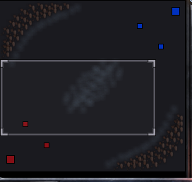
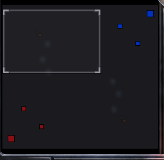
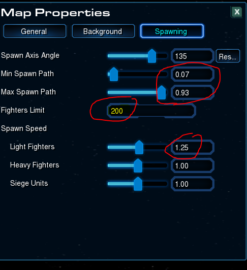

# Star Battle Reloaded 5.1 - Patch Notes

## Maps

Two more community battle maps by **OG**, selectable directly from the lobby map list (and part of the **Random [Misc]** pool):

- **Arena** — blocked-off corners with clouds tucked against the blockades, and a giant central cloud corridor to fight over — long and wide enough to make you wonder whether it's a cloud arena or open space.

- **Wide West** — a wide, open spawning lane with centered symmetry, while the side ships battle it out over uneven terrain. Its creep spawning is tuned up: the basic-fighter limit is **doubled to 200**, light fighters spawn **more often** (interval 1.2s vs. the usual 1.5s), and creep spreads across nearly the full lane width instead of a narrow central band.

\
*Wide West's spawn settings — doubled fighter limit and a near-full-width spawn path (author's editor view; the shipped light-fighter interval is 1.2s).*

The **map picker is now available in the Balanced variant** as well (previously Premade-only) — the host can choose the battlefield, defaulting to **Random [All]** when left unchanged.

## Ships & Balance

### VoidRay

Follow-up tuning to the Energy Nova rework from 5.0. As a reminder, Energy Nova is an instant, armor-ignoring point-blank burst dealing **125 (+1275 vs. Massive)** damage. This patch:

- Widened its reach — base radius **4 → 6**, and it's now anchored to the Void Ray so the ship's own size extends the effective blast to **7**.
- **Friendly fire** — Energy Nova now hits allied and neutral units in range at full damage, in line with every other friendly-fire ability in the mod. The Void Ray itself is still exempt.
- It now also clears **invulnerable ability projectiles** caught in the blast. A handful of projectiles are still spared: **Fusion Torpedo, Nuclear Missile, Seeker Missile, EMP, Lockdown, Siphon Energy, and Parasite**.
- **Phase Disruptors can now fire while the Prismatic Beam is channeling** — the two weapons are no longer mutually exclusive.

### Battlecruiser

- **Mini Yamato Gun** reverted to its original passive, closest-target auto-fire. The focus-fire targeting introduced earlier is gone; the 900 damage and upgrade cost are unchanged.

### Carrier

- Interceptor **hull and shields** upgrade now grants **+3 per level** (was +2) to both.
- **Vortex** reverted to its earlier behavior to address a bug where casting backwards at maximum range could cancel the cast. Base range reduced **10 → 9** to offset the change (net max cast range ≈14, down from ≈15).

### Colossus

- **Anti-Matter Missiles** upgrade damage reduced to **5 (+1 vs. Shields)** per level (was 6).

### Dreadnought

- **Siege Mode** bonus damage now hits enemy **structures** as well as Massive units. Bases and towers aren't flagged Massive, so they previously took no siege bonus at all — now the Gauss Cannon's bonus (and its per-level upgrade scaling) applies to them too.
- **Siege attack speed** is now a flat **2s** (was 3s) and no longer scales with upgrades.

### Frigate

- **Magnetic Mine** damage vs. Massive reduced from **550 to 450**.

### Guardian

- **Wild Mutations** now correctly applies its **+20% attack speed** to the Guardian itself. The bonus previously existed only on the ally-only buff, so the Guardian never received it despite the tooltip promising it.

### Queen

- **Blinding Cloud** sight floor raised from **2 to 8** — blinded units retain more vision.

## Bugfixes

- **Player profile** — the **Close** button is no longer hidden behind the summary panel; it's visible and clickable again.
- **Slim UI** — the command-card layout no longer scatters after loading a custom map from the lobby map picker.
- **Replay playback** — reviewing a replay no longer re-pops the end-game result screen each time you rewind past the game's end, and the console (minimap + command card) now restores correctly once that end screen is dismissed.
