# Star Battle Reloaded 5.3 - Patch Notes

## Maps

Three things change in the pool this patch: fifteen maps join, one leaves, and the standard list stops offering you the same battlefield twice over. Click any layout below to open it full size. All **31** maps are listed in the [map pool catalogue](https://tmp.talv.space/sbr/map-pool/), with full-size layouts, per-map figures and a guide to reading the previews — five of the standard maps also appear in the lobby as small-field variants.

### Experimental — fifteen new maps by VoivoD

Fifteen community maps join the pool, in a new **Experimental** category for maps that haven't been reviewed or playtested yet. They're pickable by name in the lobby — marked with a leading `*` so you can see at a glance that they're unproven — and there's a new **Random [Experimental]** entry to roll one at random.

Experimental maps are deliberately left out of **Random [All]**, the lobby default, so nobody lands on an untested layout without choosing to. A map that plays well graduates into the Community pool and loses its `*`; one that doesn't gets pulled. The old **Random [Misc]** entry is now **Random [Community]**.

Fourteen of the fifteen share the same tuned economy: light fighters spawn about **10% faster** (1.36s vs. the usual 1.5s), heavy fighters **25% faster** (48s vs. 60s), and siege fighters **four times as often** (90s vs. 360s). That's the author's own tuning, carried over from his originals intact. Mindfuck is the one exception and runs its own numbers — see its entry below.

Some of these maps give every object its own spawn chance, so they rebuild themselves on each load and no two matches use quite the same field; where the difference is large, both numbers are given below. Several of the later maps were drafted with LLM assistance and then fixed and tuned by hand, as VoivoD notes in the catalogue.

**Tunnel to Oblivion** · 227 obj

[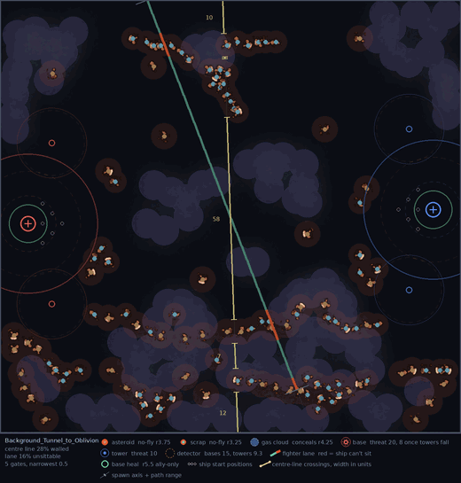](./assets/5.3/maps/tunnel-to-oblivion.png)

> The main idea was to make a corridor at the bottom that will connect two bases. As I couldn't place bases on the bottom (SBR map editor only gives you ability to offset them), then I put them in the middle. The tunnel has passages for smaller ships. But bigger ships must go all the way through.
>
> — **VoivoD**

**Circle of Death** · 151 obj

[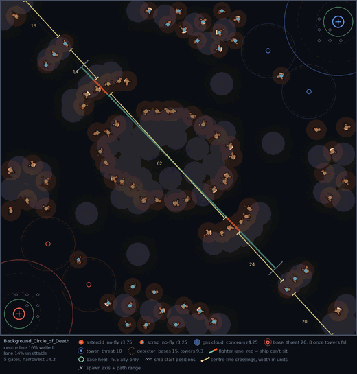](./assets/5.3/maps/circle-of-death.png)

> Basically a circle of obstacles with passages for smaller and bigger ships. There are some other obstacles at the map borders. Once bigger ships enter the circle, they must commit to exit at the other side or go back. Smaller ships have some passages to escape.
>
> — **VoivoD**

**Space Anomaly** · 104 obj

Flips the board: red spawns top-left and blue bottom-right, where nearly every other map in the game runs bottom-left against top-right. Fault Line and Mindfuck, below, take the idea further.

[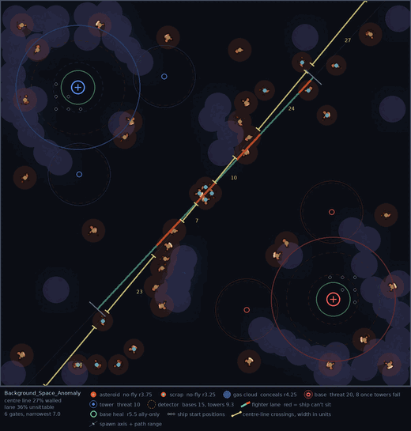](./assets/5.3/maps/space-anomaly.png)

> Where every map makes you play *up right*/*down left*, this one changes the games direction to *up left*/*down right*, effectively disorienting (long time) players. This is the main idea behind the map. To screw everything around, to make things interesting and fresh.
>
> — **VoivoD**

**Two Bacons** · 129 obj

[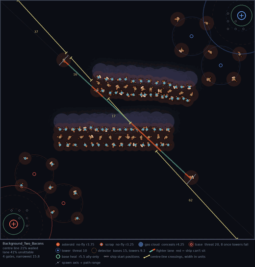](./assets/5.3/maps/two-bacons.png)

> A fun map in the vein of fy_iceworld or fy_pool_day in cs 1.6. One of these to give variety to map rotation and be absurd. Similar to Char/Port Zion but the corridor is longer and rotated 100 degrees or so. Effectively splitting the map to 3 fighting areas with the corridor area very dangerous to pass through.
>
> — **VoivoD**

**Kessel Run** · 455 authored, ~191 per match

The most extreme of the semi-random layouts: 237 of its 455 objects roll at just 10% and another 102 at 50%, so only about a third of the field turns up on any given load.

[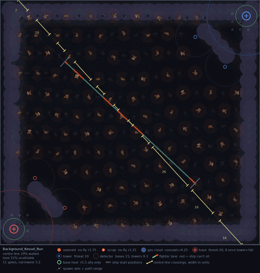](./assets/5.3/maps/kessel-run.png)

> This map is semi-randomly generated each time it's loaded. Or to be precise - filled with obstacles with fairly low chance to spawn. Large map, so faster farm spawn and limits. This map is different each time.
>
> — **VoivoD**

**Most Manly Map** · 181 obj

[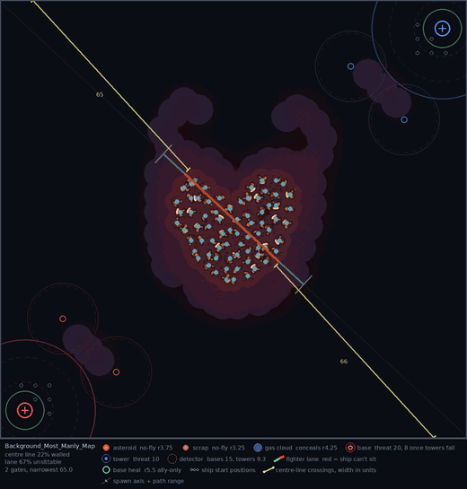](./assets/5.3/maps/most-manly-map.png)

> This is a big heart of obstacles with red clouds all around it. Splits the map into two fighting areas. I added some cloud "horns" to enhance tactical play. Fun and absurd map just like "Two Bacons".
>
> — **VoivoD**

**Maelstrom** · 104 obj

[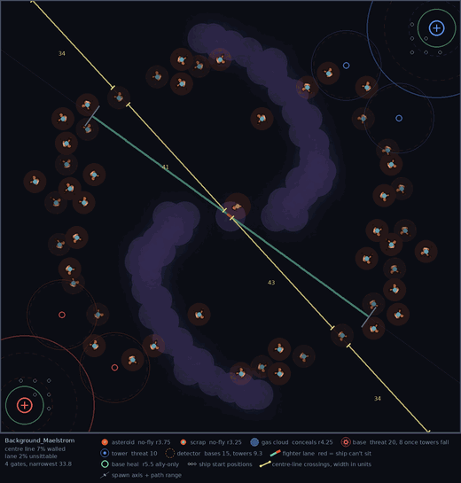](./assets/5.3/maps/maelstrom.png)

> Just played this one, and the map is very good to play. This is one of the top maps, like Space Anomaly. Chaotic. Gameplay was really good.
>
> — **VoivoD**

**Ember Gate** · 93 obj

[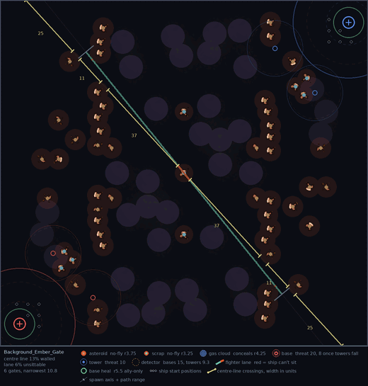](./assets/5.3/maps/ember-gate.png)

> Weird at first (no map like this one), but game was really fun. Bases are heavily fortified by obstacles, which actually makes the game a lot more balanced(!!!). There are some "vertical" obstacles, a lot of clouds, not really sure where is the actual cloud, which is unique and a plus.
>
> — **VoivoD**

**Islands** · 88 obj

[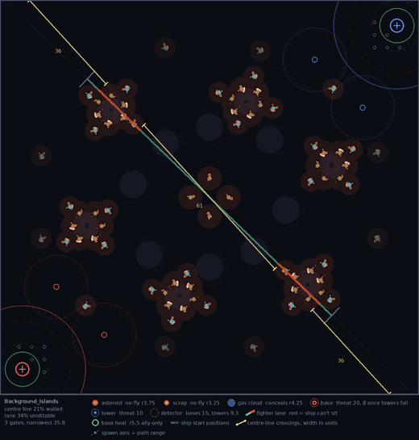](./assets/5.3/maps/islands.png)

> Basically few blobs of obstacles and some clouds. Solid map. When you try to pass the center obstacles as a bigger ship, you can get targeted by a torp and have a problem to outmaneuver it.
>
> — **VoivoD**

**Fault Line** · 102 obj

One long rift of rock and cloud cuts the field from corner to corner, with a single gap through the middle — and like Space Anomaly, it plays across the opposite diagonal to the rest of the game.

[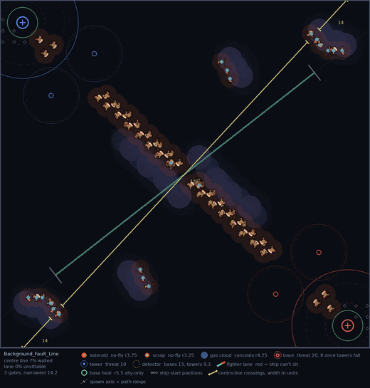](./assets/5.3/maps/fault-line.png)

> Basically long obstacle carving the map into two halves, with some clouds along the rocks. In the middle, the ships can pass through a passage. The opening was: most of the ships went one half, and enemy most ships went other half. Which was funny. Also game direction rotated 90 degrees.
>
> — **VoivoD**

**Riptide** · 94 authored, ~64 per match

The only map in the game on which *every* object rolls a spawn chance — there is no fixed furniture at all, so the wave bands sit somewhere different every single load.

[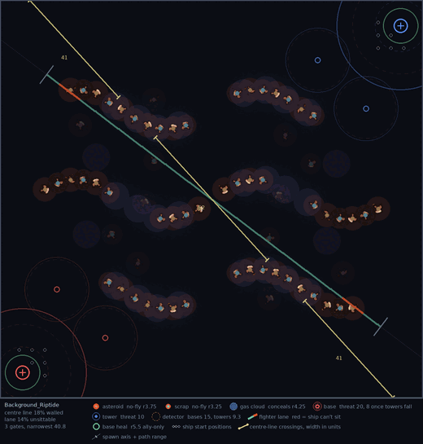](./assets/5.3/maps/riptide.png)

> Waves like rock formations, some clouds.
>
> — **VoivoD**

**Delta** · 62 authored, ~46 per match

[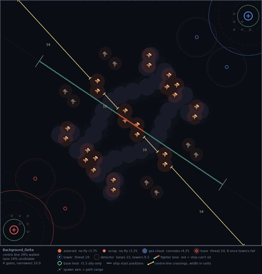](./assets/5.3/maps/delta.png)

> The clouds have a random chance to spawn, so every time it's a bit different. Quite good map.
>
> — **VoivoD**

**Crucible** · 74 authored, ~58 per match

A dense knot of rock sits dead centre, right across the line the fighters run along.

[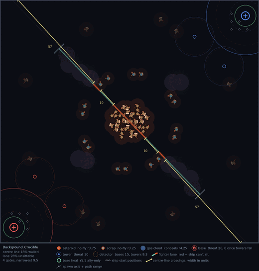](./assets/5.3/maps/crucible.png)

> This is a big blob of rocks in the center with some junk spaced apart it. Some clouds. Similar to: Most Manly Map.
>
> — **VoivoD**

**Binary** · 58 authored, ~41 per match

[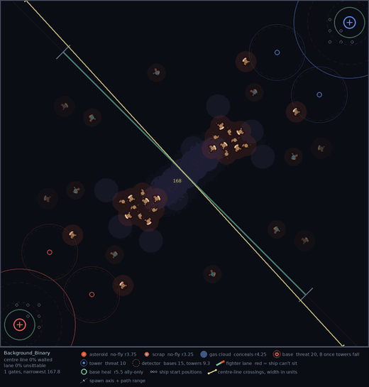](./assets/5.3/maps/binary.png)

> It's two clusters of rocks connected by clouds. Pretty good gameplay.
>
> — **VoivoD**

**Mindfuck** · 21 obj

The outlier of the set in every direction. Play runs straight up and down instead of diagonally, the bases sit **84** apart instead of the usual 160, and the economy runs at **3×** stock across the board — a light fighter every **0.5s**, a heavy every **20s**, a siege every **120s** — with the fighter cap cut to **100**. Twenty-one objects on the entire field.

[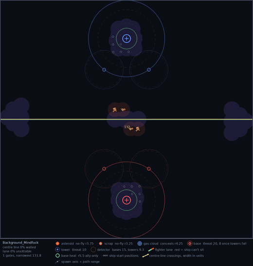](./assets/5.3/maps/mindfuck.png)

> Game direction is now up and down. Bases are moved to the center, then spaced apart. There is some space behind bases. Cool looking clouds in the base, left and right of the center of the map, and in the center with few rocks. This is SBR action on steroids.
>
> — **VoivoD**

### Four Lanes I retired

**Four Lanes I** is out of the lobby list and both random pools after persistent negative feedback on how it played. It's still available in sandbox, in the map editor and via `-map`. **Four Lanes II** stays in the pool for now.

### One lobby entry per battlefield

The standard map list has been showing you ten names for five battlefields. Every built-in layout shipped under two different skyboxes, and the lobby keyed its entries on the skybox rather than the battlefield — so Avernus and Braxis Alpha, Char and Port Zion, Skygeirr and Ulnar, Castanar and Ulaan, Deep Space and Korhal City were each the same field of play twice over, right down to the object placement.

Each pair now has a single entry, renamed to say what you're actually picking:

| Now reads | Retired duplicate |
|---|---|
| **Rocks - Braxis Alpha** | Avernus |
| **Rocks & Cloud - Castanar** | Ulaan |
| **Tunnels - Port Zion** | Char |
| **Clouds - Ulnar** | Skygeirr |
| **Open - Deep Space** | Korhal City |

Nothing about how these maps play has changed, and no layout was lost — the duplicates were identical to the entries that remain. What does go is five skyboxes, and the survivors were picked for how clearly gameplay objects read against the sky, not for which looked best standing still. Avernus's planet-and-sunflare is the real casualty there.

The retired backgrounds are still fully available in the map editor, in sandbox, and to saved custom maps; they're only gone from the lobby list, where the standard map section drops from ten entries to five.

## Ships & Balance

### Dreadnought

- **Griffon** fighters attack faster — period **3.3s → 2.5s**, about a third more shots in the same time. 3.3s was the longest period of any onboard fighter in the game, and it was drift rather than a decision: 2.5s is what Star Battle ran before SBR forked, and what the other forks still run. The info panel had been quoting **2.2s** throughout, matching neither, and now shows the real number.

### Frigate

**Jamming Systems** has stopped hiding the Frigate and started jamming the enemy instead.

- **The Frigate is now a normal ship on radar and scan.** In exchange, Jamming Systems projects a permanent **30-radius** bubble that shuts down enemy radar inside it — a Raven that has researched Radar stops seeing the map while it's in range, and a Battlecruiser's Scanner Sweep goes dark for as long as it stays there. Allies are never affected.
- **Cloak detection is untouched.** A jammed Battlecruiser keeps detecting; it only loses the sweep's map-wide vision. Jamming interferes with what the enemy can *see at range*, not with what they can *reveal*.
- **The downtime is gone entirely.** Jamming Systems used to switch off for 20 seconds whenever the Frigate used Afterburners, Ion Cannon, Magnetic Mine, Quick Reload, Fusion Torpedo, or fired a Ripwave volley. There is no lockout any more — it is simply always on.

The same enemy ship, in the same place, seen on radar from outside the bubble and from inside it:

[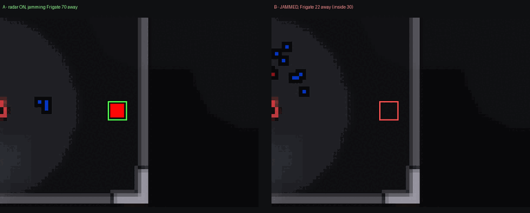](./assets/5.3/frigate-jamming.png)

**Shield Booster** picks up the out-of-combat shield regeneration that used to ride on Jamming Systems, at a quarter of its old strength.

- **Out of combat**, shields ramp back up to **+100/s** over **60s** — down from the **+400/s** the old Jamming Systems ramp reached over the same window. The bonus is flat rather than per-level, so it matters most to a Frigate that hasn't invested in shields yet and fades as you upgrade.
- **In combat**, shield regeneration is **halved**.
- **It no longer requires Afterburners.** Shield Booster is a standalone **200** mineral purchase; it used to sit behind a **150**-mineral Afterburners purchase before you could buy it at all.

### Guardian

**Posthumous Mitosis** is now called **Endless Swarm**, and it has been rebuilt into a full upgrade rather than a death trigger. Owning it changes how the swarm lives, not just how it dies.

- **Your swarm lasts twice as long, from the moment you buy it.** Corruptors go from **50s to 100s**, Brood Lords from **45s to 90s**. This applies while the Guardian is alive and well. Both Spawn tooltips quote the new numbers.
- **On the Guardian's death, everything still alive stops expiring and gets stronger.** Living Corruptors and Brood Lords lose their time limit for good and take a permanent **double armour**. Corruptors also gain **+20 damage** — a second Parasite Spore's worth on top of their own — and that bonus rises with the Corruptors upgrade, so it stays equal to their base attack at every level. Brood Lords' Broodling strikes are deliberately unchanged, so their share of the payload is the armour and the lifted time limit.
- **Leftover energy hatches into more Corruptors.** A dying Guardian spends whatever energy it had left on cocoons, **one per 50 energy**, uncapped — 200 energy is four more Corruptors. They hatch a few seconds later and join the swarm already freed and empowered.
- **The payload no longer gets skipped by unusual deaths.** Endless Swarm used to fire only when the Guardian was killed by ordinary damage, so a kill that arrived any other way — a Queen's Neural Parasite ending its own host, for instance — dropped the whole thing silently. It now fires however the Guardian dies.
- The death spawn itself is unchanged: still **15** Scourges, and **2** Broodlings per Brood Lord kill. Brood Lord strike escorts still expire normally.

**Dark Swarm** now heals your own side for as long as it's up. Until this patch the cloud carried no stat effect at all — it existed purely to stop ranged weapons firing into it.

- **Allied Zerg capital ships regenerate 50 life/s inside the cloud** while out of combat — Guardian, Queen, Leviathan and Overlord. The five-second out-of-combat gate is the same one a capital ship's own regeneration already uses, so the bonus and the base rate switch on and off together.
- **Allied spawned minions regenerate 5 life/s**, with no combat gate at all. They're the units most likely to be under fire, and they already regenerated while taking it.
- **Enemies get none of it.** Anything hostile sitting in the cloud keeps the ranged-attack protection it always had, but takes no healing from it.
- Radius and the **20-second** duration are unchanged. The tooltip now states both rates.

**Decay** has been rebuilt around a different trigger, and it is now cheaper to reach, weaker at full stacks, and no longer all-or-nothing.

- **It builds from Acid Spores instead of Corrosive Acid.** Every Acid Spore hit adds a stack, to a maximum of **10**. Decay used to key off Corrosive Acid — a 35-energy cast on a cooldown — so filling the bar took between 20 and 80 seconds depending on upgrades. Acid Spores fire free on a **2-second** period, and the bar now fills in about **18 seconds**, which makes Decay close to permanent in any sustained fight.
- **Acid Spores can't hit Light units, so farming builds no Decay.** Onboard fighters are Light and it's Needle Spines that shoots them — a Guardian working the fighter lane stacks nothing at all. Nothing in the game said so before; the tooltip now does.
- **It no longer requires Corrosive Acid**, so an acidless Guardian can buy it. It costs **200** minerals on its own, up from 175 — without the rise, dropping the 125-mineral prerequisite would have cut the cost of reaching Decay from 300 to 175, undercutting its own tier.
- **Damage reduction at full stacks is 25%**, down from 30%.
- **Its armour no longer scales with Carapace.** Every Carapace level used to quietly buy extra armour through Decay on top of the ship's own — about **+0.7** per level at full stacks, climbing to **+15.6** by level 20. Decay's share is now flat. The ship's own armour still scales from Carapace exactly as before.
- **Stacks bleed off one at a time.** They used to share a single timer and vanish together the moment it ran out. Each stack now runs its own **22-second** life, so after a disengage you lose them gradually instead of off a cliff.

**Brood Lord and Corruptor acceleration is back to where it was before 5.0.** That patch raised both minions to 1.5; they return to **0.9375** for Corruptors and **0.1875** for Brood Lords. Measured over 20 units of open space, a Brood Lord now takes about **18.8s** to arrive where it took 14.6s, and a Corruptor **13.1s** against 12.8s — so it is the Brood Lord that really feels it.

### Queen

**Blinding Cloud** has been rebuilt around what it was always supposed to do — blind things — and it now reaches the minions that were ignoring it entirely.

- **Minions are blinded and out-ranged.** Previously only capital ships were affected, and every fighter inside the cloud kept firing at full range. Now every Light unit caught in the cloud has its sight cut to **4**, and the ones that fight at range lose reach with it: Siege Fighters, Tempests and Brood Lords **−10** weapon range, onboard fighters (Interceptors, Wraiths, Mutalisks, Locusts and the rest) **−1**.
- **Capital ships** have their sight cut to **8** and still lose the benefit of allied vision. That floor now actually holds — the old version was collapsing sight to 1–2 in practice.
- **The vision wall is gone.** Blinding Cloud used to stamp a block of sight-blocking terrain on the map, which never worked as intended and didn't conceal the cloud's interior anyway. It also no longer suppresses radar or detection, so a Raven keeps its radar and a Battlecruiser's active Scanner Sweep keeps detecting through the cloud.
- Radius, duration and cast are unchanged, and the tooltip now spells out all four cases.

## Squads

Squads used to be claimed on the Battle.net lobby screen, in public, before the game began. Everyone could see who had paired with whom, and hosts had started kicking squadded players on sight — which defeated the whole point of the feature. There are now two ways to pair, and neither of them tells the rest of the lobby anything.

**The lobby slot still works, and it's private now.** Two players claim the same squad number on the lobby screen, exactly as before — except the setting is visible only to the player who set it. Nobody else can see that you claimed a half, so there is nothing left to be kicked for. The cost is that you can't see your partner's pick either, so agree a number between you beforehand. If you claim a half and nobody takes the other, you're told privately at the start of the match — *"Nobody took the other half of your squad."* — instead of being left to wonder whether you mistyped or your partner never showed.

**Your squad is also a standing list on your profile.** It lives in your bank and persists between games, so you set it up once with the people you actually play with instead of re-declaring it every lobby. A pair is only honoured when *both* of you hold each other on your list — consent is built into how it's stored, so adding someone one-sidedly achieves nothing.

- **A Squad tab on your own profile** holds the list, marks who's in the current match with you, and lets you add someone by handle, remove them, or switch pairing off entirely. It holds **16** people and nothing on it expires.
- **A "Play together" button on another player's profile** sends a private invite to accept or decline. When a request wouldn't go through the button greys out and says why, and invites are capped so they can't be used to pester anyone.
- **A list pairing starts from your *next* match.** The teams for the game you arrange it in were settled before either of you clicked, so it never applies to that one — the thing most likely to look broken when it isn't. A lobby slot has no such delay: it's claimed before the game exists, so it counts for the match you claim it in.
- **Where both could pair you, the lobby wins.** Claiming a slot with someone overrides whoever your list would otherwise have seated you with, and nobody is told.
- **Nothing is ever shown to a third party** — not which slot you took, not that you sent an invite, nor that one was declined.
- **Pairing no longer distorts your rating.** Being squadded still counts toward how the teams are seated — that is what stops a strong player pairing with an underrated alt to bend the balance — but it's dropped from the rating you gain or lose at the end, so results are scored on honest numbers.

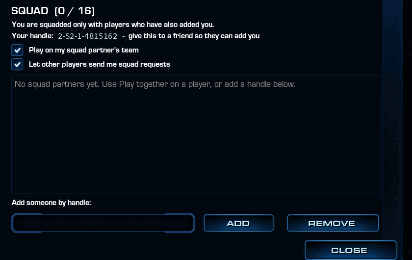

**Squads no longer break team sizes.** A mechanism meant to keep a pair together could seat a 12-player game as 5v7, and it fired far more often than intended — with the top-rated pair in the lobby it happened *every* game. It's gone, and team sizes are never bent to fit a squad.

Up to six squads can be honoured in one match, up from five. If a lobby holds more than will seat evenly, the surplus is skipped for that match — highest-rated first — and both players in a skipped pair are told; your list isn't touched, and it applies again next game.

That ceiling now counts lobby slots and list pairings together, which finally gives lobby slots an even-teams guarantee they never had: three claimed squads in a six-player game used to seat it 4v2.

Two further fixes to how squads feed team balance:

- **A partner who left before the match started no longer inflates your rating.** Theirs was still being counted toward yours for seating — by as much as **400** points — long after they'd gone.
- **A squad with only one player in it no longer pins that player in place.** The balancer refuses to move anyone carrying a squad, so a half-claimed pair left the remaining player stuck wherever they first landed.

If you have a regular partner, the list is the one to use — you add each other in game once and it stands from then on, with no number to agree and nothing to redo each lobby. There's a [full walkthrough](https://tmp.talv.space/sbr/squads/) with screenshots and the complete rule list.

## Interface

### Upcoming events on the post-game screen

The end-of-game screen now carries an **UPCOMING EVENTS** card alongside the existing links, listing the next tournament dates with a live countdown against each one — `TODAY`, `TOMORROW`, or `IN n DAYS`, with the nearest date highlighted. Dates drop off the card as they pass, and once they've all gone the card disappears with them. An **ENTER THE ARENA** button goes straight to the tournament page.

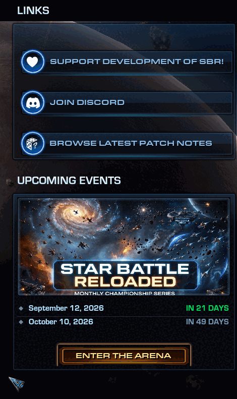

### Event takeover on the loading screen

The loading screen can now hand itself over to a full-screen tournament promo. Whether you see one depends on whether an event is scheduled when the build is made — outside an event window the loading screen is exactly the one you already know. When a promo does run, the loading bar and its percentage stay on top of it, so you can still see how far along the load is.

[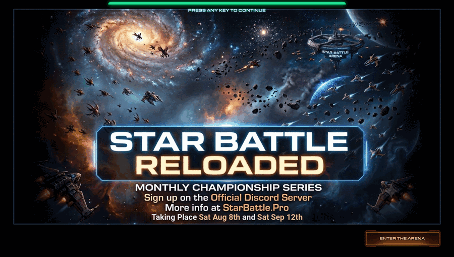](./assets/5.3/loading-screen-takeover.png)

### Lobby

The **Toggleable Shields** option and the game-data variant selector next to it have both been removed from the lobby. Both were experiments that never graduated.

## Ship restrictions

Some ships stay locked until you've earned them, and veterans are meant to have a second route: your recorded match history standing in for the wins. That route has been broken for a long time. The data behind it has shipped empty since **January 2022**, so for most of that time it quietly did nothing for anybody, and on EU it was worse still — it consulted a table that had never existed under any name.

- **That data is rebuilt, and now refreshes with every release**, so the exemption actually resolves again.
- **The veteran bypass is back, as a conversion.** From **125** recorded games upward, every **5** recorded games count as **one win** toward unlocking ships, and whichever is higher — that figure or the win count in your bank — is the one that applies. If you've played for years and lost your bank file, your record on the ladder now counts for something again.
- Recorded games only ever unlock ships *for you*. They can't push a lobby over the threshold that turns restrictions on in the first place.
- **Region gating is correct again.** A change last December had swapped it: the newbie lock had silently narrowed to EU only, and the veteran lock had begun applying on US, where it was never meant to.
- **The restricted-ship tooltip now names the real cause.** It used to blame the experience of other players on your team; a lock is decided by your own record.

## Bugfixes

- **A full lobby no longer starts a player short.** With every slot taken and fewer than two left free, the game could draft one of the actual participants as a team's base NPC. That player never got a start location or a ship, so a game balanced as 6v6 began 5v6, and if they then left, their own team inherited control of the base and its mineral pool. The draft can no longer land on somebody who is playing, and a player with no start location no longer burns a team ship slot to produce nothing.
- **A leaver's ship no longer locks up when the player who claimed it dies.** Claiming an abandoned ship transfers control to you — but if you were then killed, that control was never handed back, and the ship stayed stuck to a dead player for the rest of the match. Nobody on the team could command or upgrade it, whatever they tried. Control now returns to the team on death, the same way it already did when a claimer left or was declared traitor.
- **The weapon range indicator no longer silently fails.** On weapons whose tooltip range isn't a plain number, the indicator simply didn't draw — it now falls back to the computed range.
- **Ripwave Warheads tells you what it costs.** The tooltip never mentioned that each volley drains energy; it now states the figure — **15** per volley — and reads it from the ability itself, so it can't go stale again.

