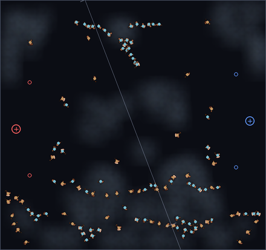
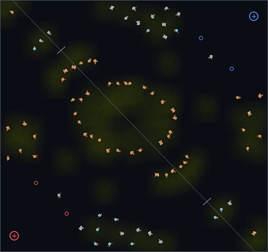
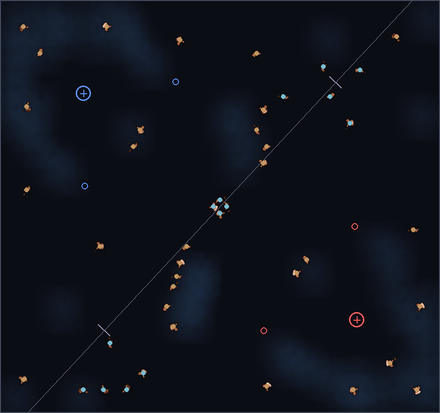
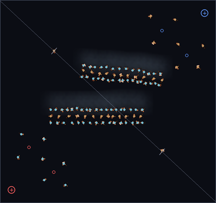
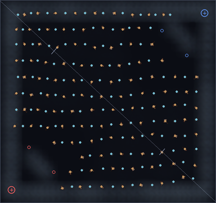
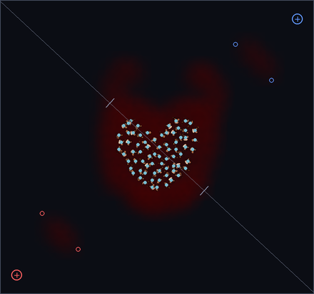
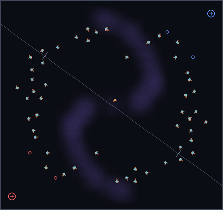
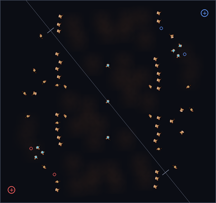
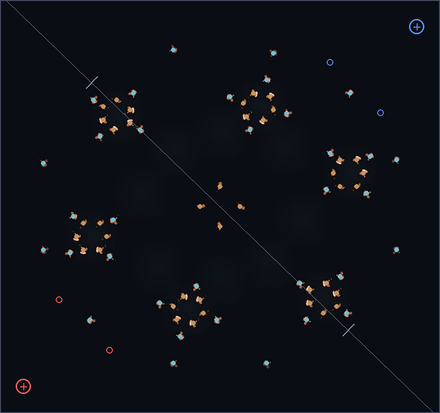

# Star Battle Reloaded 5.3 - Patch Notes

## Maps

### Experimental — nine new maps by VoivoD

Nine community maps join the pool, in a new **Experimental** category for maps that haven't been reviewed or playtested yet. They're pickable by name in the lobby — marked with a leading `*` so you can see at a glance that they're unproven — and there's a new **Random [Experimental]** entry to roll one at random.

Experimental maps are deliberately left out of **Random [All]**, the lobby default, so nobody lands on an untested layout without choosing to. A map that plays well graduates into the Community pool and loses its `*`; one that doesn't gets pulled. The old **Random [Misc]** entry is now **Random [Community]**.

All nine share the same tuned economy: light fighters spawn about **10% faster** (1.36s vs. the usual 1.5s), heavy fighters **25% faster** (48s vs. 60s), and siege fighters **four times as often** (90s vs. 360s). That's the author's own tuning, carried over from his originals intact.

**Tunnel to Oblivion** · 227 obj

> The main idea was to make a corridor at the bottom that will connect two bases. As I couldn't place bases on the bottom (SBR map editor only gives you ability to offset them), then I put them in the middle. The tunnel has passages for smaller ships. But bigger ships must go all the way through.
>
> — **VoivoD**

**Circle of Death** · 151 obj

> Basically a circle of obstacles with passages for smaller and bigger ships. There are some other obstacles at the map borders. Once bigger ships enter the circle, they must commit to exit at the other side or go back. Smaller ships have some passages to escape.
>
> — **VoivoD**

**Space Anomaly** · 104 obj

The one map that flips the board: red spawns top-left and blue bottom-right, where every other map in the game runs bottom-left against top-right.

> Where every map makes you play *up right*/*down left*, this one changes the games direction to *up left*/*down right*, effectively disorienting (long time) players. This is the main idea behind the map. To screw everything around, to make things interesting and fresh.
>
> — **VoivoD**

**Two Bacons** · 129 obj

> A fun map in the vein of fy_iceworld or fy_pool_day in cs 1.6. One of these to give variety to map rotation and be absurd. Similar to Char/Port Zion but the corridor is longer and rotated 100 degrees or so. Effectively splitting the map to 3 fighting areas with the corridor area very dangerous to pass through.
>
> — **VoivoD**

**Kessel Run** · 455 authored, ~190 per match

Every object on this map carries its own spawn chance, so it rebuilds itself every time it loads — 237 of its 455 objects roll at 10%, another 102 at 50%. You never play the same Kessel Run twice.

> This map is semi-randomly generated each time it's loaded. Or to be precise - filled with obstacles with fairly low chance to spawn. Large map, so faster farm spawn and limits. This map is different each time.
>
> — **VoivoD**

**Most Manly Map** · 181 obj

> This is a big heart of obstacles with red clouds all around it. Splits the map into two fighting areas. I added some cloud "horns" to enhance tactical play. Fun and absurd map just like "Two Bacons".
>
> — **VoivoD**

**Maelstrom** · 104 obj

> Just played this one, and the map is very good to play. This is one of the top maps, like Space Anomaly. Chaotic. Gameplay was really good.
>
> — **VoivoD**

**Ember Gate** · 93 obj

> Weird at first (no map like this one), but game was really fun. Bases are heavily fortified by obstacles, which actually makes the game a lot more balanced(!!!). There are some "vertical" obstacles, a lot of clouds, not really sure where is the actual cloud, which is unique and a plus.
>
> — **VoivoD**

**Islands** · 88 obj

> Basically few blobs of obstacles and some clouds. Solid map. When you try to pass the center obstacles as a bigger ship, you can get targeted by a torp and have a problem to outmaneuver it.
>
> — **VoivoD**

### One lobby entry per battlefield

The standard map list has been showing you ten names for five battlefields. Every built-in layout shipped under two different skyboxes, and the lobby keyed its entries on the skybox rather than the battlefield — so Avernus and Braxis Alpha, Char and Port Zion, Skygeirr and Ulnar, Castanar and Ulaan, Deep Space and Korhal City were each the same field of play twice over, right down to the object placement.

Each pair now has a single entry, renamed to say what you're actually picking:

| Now reads | Retired duplicate |
|---|---|
| **Rocks - Braxis Alpha** | Avernus |
| **Rocks & Cloud - Castanar** | Ulaan |
| **Tunnels - Port Zion** | Char |
| **Clouds - Ulnar** | Skygeirr |
| **Open - Deep Space** | Korhal City |

Nothing about how these maps play has changed, and no layout was lost — the duplicates were identical to the entries that remain. What does go is five skyboxes, and the pick was made on how clearly gameplay objects read against the sky rather than on which looked best standing still. Avernus's planet-and-sunflare is the real casualty there.

The retired backgrounds are still fully available in the map editor, in sandbox, and to saved custom maps; they're only gone from the lobby list, which drops from 36 rows to 31.

## Ships & Balance

### Frigate

**Jamming Systems** has stopped hiding the Frigate and started jamming the enemy instead.

- **The Frigate is now a normal ship on radar and scan.** It no longer conceals itself. In exchange, Jamming Systems projects a permanent **30-radius** bubble that shuts down enemy radar inside it — a Raven that has researched Radar stops seeing the map while it's in range, and a Battlecruiser's Scanner Sweep goes dark for as long as it stays there. Allies are never affected.
- **Cloak detection is untouched.** A jammed Battlecruiser keeps detecting; it only loses the sweep's map-wide vision. Jamming interferes with what the enemy can *see at range*, not with what they can *reveal*.
- **The downtime is gone entirely.** Jamming Systems used to switch off for 20 seconds whenever the Frigate used Afterburners, Ion Cannon, Magnetic Mine, Quick Reload, Fusion Torpedo, or fired a Ripwave volley. There is no lockout any more — it is simply always on.

**Shield Booster** picks up the out-of-combat shield regeneration that used to ride on Jamming Systems, at a quarter of its old strength.

- **Out of combat**, shields ramp back up to **+100/s** over 60 seconds — down from the **+400/s** the old Jamming Systems ramp reached over the same 60. The bonus is flat rather than per-level, so it matters most to a Frigate that hasn't invested in shields yet and fades as you upgrade.
- **In combat**, shield regeneration is **halved**.
- **It no longer requires Afterburners.** Shield Booster is a standalone **200** mineral purchase; it used to cost 150 for Afterburners on top of that before you could buy it at all.

### Guardian

**Posthumous Mitosis** is now called **Endless Swarm**, and it has been rebuilt into a full upgrade rather than a death trigger. Owning it changes how the swarm lives, not just how it dies.

- **Your swarm lasts twice as long, from the moment you buy it.** Corruptors go from **50s to 100s**, Brood Lords from **45s to 90s**. This applies while the Guardian is alive and well — you no longer have to die to get value out of the upgrade. Both Spawn tooltips quote the new numbers.
- **On the Guardian's death, everything still alive stops expiring and gets stronger.** Living Corruptors and Brood Lords lose their time limit for good and take a permanent **double armour**. Corruptors also gain **+20 damage** — a second Parasite Spore's worth on top of their own — and that bonus rises with the Corruptors upgrade, so it stays equal to their base attack at every level. Brood Lords fight through their Broodling strikes, which are deliberately left alone, so for them it's the armour and the reprieve.
- **Leftover energy hatches into more Corruptors.** A dying Guardian spends whatever energy it had left on cocoons, **one per 50 energy**, uncapped — 200 energy is four more Corruptors. They hatch a few seconds later and join the swarm already freed and empowered.
- **The payload no longer gets skipped by unusual deaths.** Endless Swarm used to fire only when the Guardian was killed by ordinary damage, so a kill that arrived any other way — a Queen's Neural Parasite ending its own host, for instance — dropped the whole thing silently. It now fires however the Guardian dies.
- The death spawn itself is unchanged: still **15** Scourges, and **2** Broodlings per Brood Lord kill. Brood Lord strike escorts still expire normally.

<!-- [TODO] Dark Swarm regeneration is NOT in the note because it has not landed: as of
     2026-09-01 star-battle/sbr-map@e01c22618ba5ca2048914b779f3df9059182be13 is a lone unmerged
     commit on branch 210-dark-swarm-regeneration (#210), and master is at 570ac4ea. When it
     merges, add under Guardian: allied biological units regenerate inside the cloud — Zerg
     capital ships (Guardian, Queen, Leviathan, Overlord) 50 life/s while out of combat,
     spawned minions 5 life/s ungated; enemies keep the ranged protection but get no healing;
     radius 4 and the 20s duration unchanged. Values verified against the behaviour diff and
     the tooltip strings it rewrites. -->

### Queen

**Blinding Cloud** has been rebuilt around what it was always supposed to do — blind things — and it now reaches the minions that were ignoring it entirely.

- **Minions are blinded and out-ranged.** Previously only capital ships were affected, and every fighter inside the cloud kept firing at full range. Now every Light unit caught in the cloud has its sight cut to **4**, and the ones that fight at range lose reach with it: Siege Fighters, Tempests and Brood Lords **−10** weapon range, onboard fighters (Interceptors, Wraiths, Mutalisks, Locusts and the rest) **−1**.
- **Capital ships** have their sight cut to **8** and still lose the benefit of allied vision. That floor now actually holds — the old version was collapsing sight to 1–2 in practice.
- **The vision wall is gone.** Blinding Cloud used to stamp a block of sight-blocking terrain on the map, which never worked as intended and didn't conceal the cloud's interior anyway. It also no longer suppresses radar or detection, so a Raven keeps its radar and a Battlecruiser's active Scanner Sweep keeps detecting through the cloud.
- Radius, duration and cast are unchanged, and the tooltip now spells out all four cases.

<!-- [TODO] No designer-rationale issue exists for 5.3 yet (v5.2's was sbr-map#177,
     "changelog 5.2 explanation - save for release"). When OG files the 5.3 one, fold each
     block in as a "> " aside under the ship it explains — Guardian and Queen both want one. -->

## Interface

### Upcoming events on the post-game screen

The end-of-game screen now carries an **UPCOMING EVENTS** card alongside the existing links, listing the next tournament dates with a live countdown against each one — `TODAY`, `TOMORROW`, or `IN n DAYS`, with the nearest date highlighted. Dates drop off the card as they pass, and once they've all gone the card disappears with them. An **ENTER THE ARENA** button goes straight to the tournament page.

### Event takeover on the loading screen

The loading screen can now hand itself over to a full-screen tournament promo while an event is running. The loading bar and its percentage stay on top of the takeover, so you can still see how far along the load is. Outside an event window the usual loading screen is untouched.

### Lobby

The **Toggleable Shields** option and the game-data variant selector next to it have both been removed from the lobby. Both were experiments that never graduated.

## Ship restrictions

The exemption that lets your recorded match history stand in for wins has been broken for a long time — the tables it reads have shipped empty since **January 2022**, so for most of that time it quietly returned nothing for everybody. On EU it was worse: it consulted a table that had never existed under any name.

- **Those tables are rebuilt and now travel inside the map**, refreshed with every release instead of waiting on a separate upload, so the exemption actually resolves again.
- **The veteran bypass is back, as a conversion.** From **125** recorded games upward, every **5** recorded games count as **one win** toward unlocking ships, and whichever is higher — that figure or the win count in your bank — is the one that applies. If you've played for years and lost your bank file, your record on the ladder now counts for something again.
- Recorded games only ever unlock ships *for you*. They can't push a lobby over the threshold that turns restrictions on in the first place.
- **Region gating is correct again.** A refactor last December had swapped it: the newbie lock had silently narrowed to EU only, and the veteran lock had begun applying on US, where it was never meant to.
- **The restricted-ship tooltip now names the real cause.** It used to blame the experience of other players on your team; a lock is decided by your own record.

## Bugfixes

- **A leaver's ship no longer locks up when the player who claimed it dies.** Claiming an abandoned ship transfers control to you — but if you were then killed, that control was never handed back, and the ship stayed stuck to a dead player for the rest of the match. Nobody on the team could command or upgrade it, whatever they tried. Control now returns to the team on death, the same way it already did when a claimer left or was declared traitor.
- **The weapon range indicator no longer silently fails.** On weapons whose tooltip range isn't a plain number, the indicator simply didn't draw — it now falls back to the computed range.
- **Ripwave Warheads tells you what it costs.** The tooltip never mentioned that each volley drains energy; it now states the figure — **15** per volley — and reads it from the ability itself, so it can't go stale again.

<!-- [TODO] Frontmatter is deliberately unfinalized: this release is not tagged or promoted.
     On publish, set published (…T00:00Z), status: live, and buildId from
     `git describe --tags --always --match 'v*' <published-commit>` in sbr-map. -->
