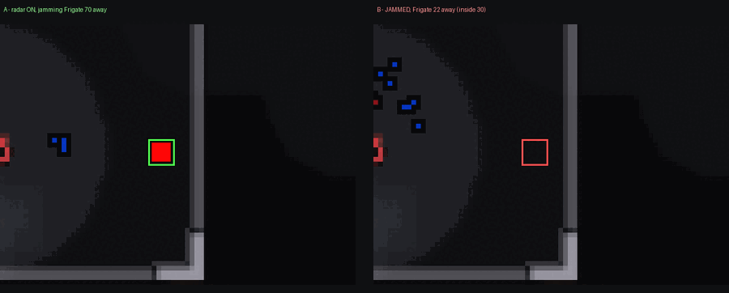
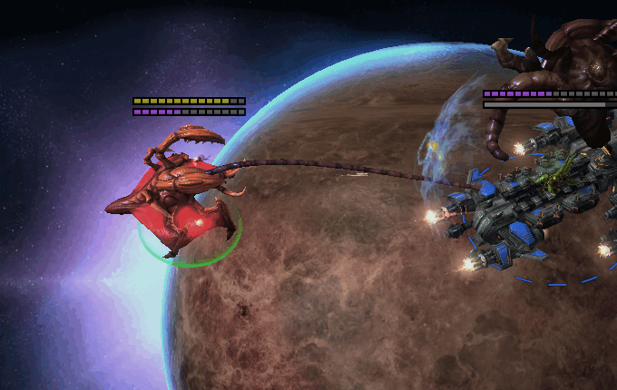
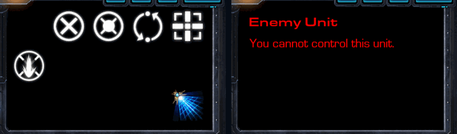
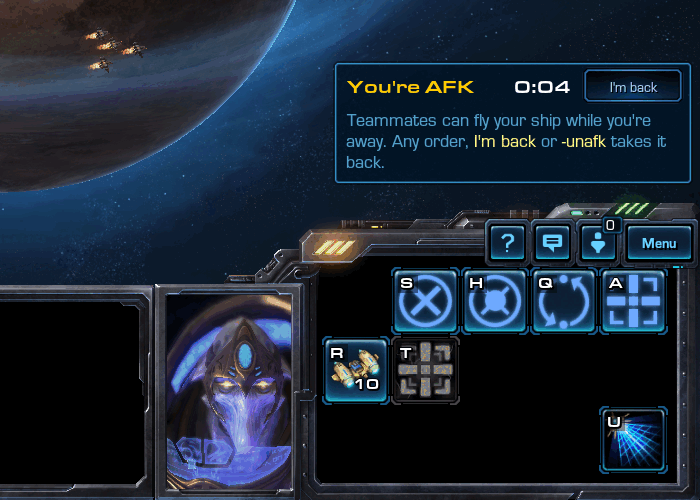
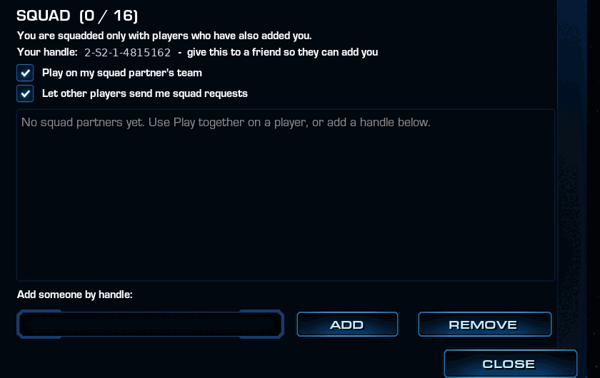
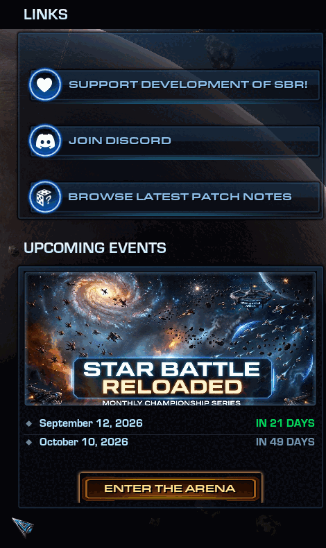
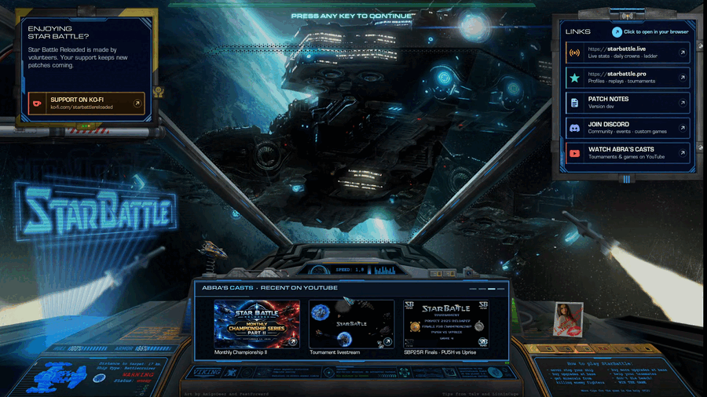
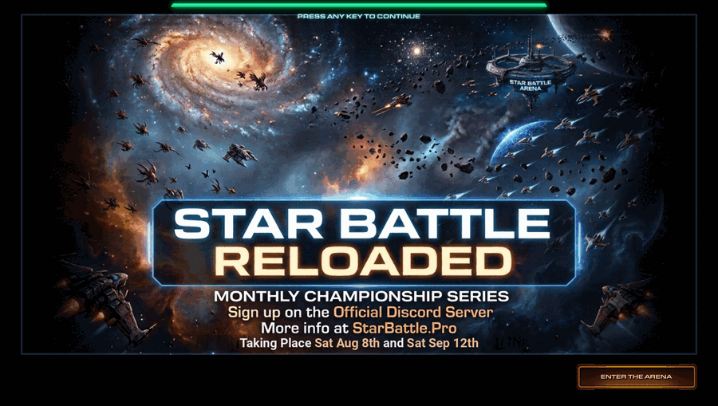
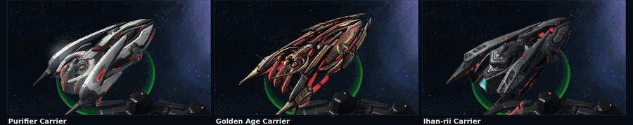

# Star Battle Reloaded 5.3 - Patch Notes

## Maps

Fifteen maps join the pool, one leaves, and the standard list stops offering the same battlefield twice. The one leaving is **Four Lanes I** — out of the lobby list and the random pools after persistent negative feedback; **Four Lanes II** stays. All **31** maps are in the [map pool catalogue](https://tmp.talv.space/sbr/map-pool/), with full-size layouts, per-map figures and a guide to reading the previews.

### Experimental — fifteen new maps by VoivoD

Fifteen community maps join the pool, in a new **Experimental** category for maps that haven't been reviewed or playtested yet. They're pickable by name in the lobby — marked with a leading `*` so you can see at a glance that they're unproven — and there's a new **Random [Experimental]** entry to roll one at random.

Experimental maps are deliberately left out of **Random [All]**, the lobby default, so nobody lands on an untested layout without choosing to. A map that plays well graduates into the Community pool and loses its `*`; one that doesn't gets pulled. The old **Random [Misc]** entry is now **Random [Community]**.

Fourteen of the fifteen run VoivoD's own faster economy: light fighters spawn about **10% more often** (every 1.36s instead of 1.5s), heavy fighters **25% more often** (48s instead of 60s), and siege fighters **four times as often** (90s instead of 360s). Mindfuck is the exception and runs its own numbers.

Some of these maps place their objects at random on each load, so no two matches use quite the same field. Layouts, per-map figures and VoivoD's own notes on each map — including which were drafted with LLM assistance and then fixed and tuned by hand — are in the [map pool catalogue](https://tmp.talv.space/sbr/map-pool/).

### One lobby entry per battlefield

The standard map list has been showing ten names for five battlefields: every built-in layout shipped under two skyboxes, each with its own lobby entry, identical in play right down to object placement.

Each pair now has a single entry, renamed to say what you're actually picking:

| Now reads | Retired duplicate |
|---|---|
| **Rocks - Braxis Alpha** | Avernus |
| **Rocks & Cloud - Castanar** | Ulaan |
| **Tunnels - Port Zion** | Char |
| **Clouds - Ulnar** | Skygeirr |
| **Open - Deep Space** | Korhal City |

Nothing about how these maps play has changed. What goes is five skyboxes — the survivors were picked for how clearly gameplay objects read against the sky, not for looks, so Avernus's planet-and-sunflare is the real casualty.

The retired backgrounds are still available in the map editor, in sandbox and to saved custom maps — they're only gone from the lobby list.

## Ships & Balance

### Dreadnought

- **Griffon** fighters attack faster — period **3.3s → 2.5s**, about a third more shots in the same time. Griffons had felt sluggish next to the other onboard fighters: slow to take the initiative, quick to overkill. 2.5s is what Star Battle ran before SBR. The info panel had been quoting **2.2s**, and now shows the real number.

### Frigate

**Jamming Systems** has stopped hiding the Frigate and started jamming the enemy instead.

- **The Frigate is now a normal ship on radar and scan.** In exchange, Jamming Systems projects a permanent **30-radius** bubble that shuts down enemy radar inside it — a Raven that has researched Radar stops seeing the map while it's in range, and a Battlecruiser's Scanner Sweep goes dark for as long as it stays there. Allies are never affected.
- **Cloak detection is untouched.** A jammed Battlecruiser keeps detecting; it only loses the sweep's map-wide vision.
- **No more downtime.** It used to switch off for 20 seconds whenever the Frigate used Afterburners, Ion Cannon, Magnetic Mine, Quick Reload, Fusion Torpedo or a Ripwave volley. Now it stays on.

The same enemy ship, in the same place, seen on radar from outside the bubble and from inside it:

**Shield Booster** picks up the out-of-combat shield regeneration that used to ride on Jamming Systems, at a quarter of its old strength.

- **Out of combat**, a shield regeneration bonus builds to **+100/s** over **60s**, down from the **+400/s** the old Jamming Systems bonus reached. The bonus is flat, not per-level, so it matters most before you've invested in shields.
- **In combat, while Afterburners is active**, shields regenerate at **half** rate — it used to be full rate.
- **It no longer requires Afterburners.** Shield Booster is a standalone **200**-mineral buy, down from **350** with the Afterburners it used to need.

**Fusion Torpedo** now clears drone and mine fields. *Experimental in 5.3: these numbers may be retuned or reverted after real games.*

- **Its blast hits structures.** Point Defense Drones and Magnetic Mines in it are destroyed, and towers and bases take damage — up to **6,000** from a blast in flight. This applies to both teams, the same as its friendly fire on ships, so your own torpedo hurts your team's drones, mines and towers.
- **It explodes at the end of its flight.** A torpedo that meets no ship used to fizzle; now it explodes there for up to **1,500** splash damage, with no burn — enough to clear drones and mines, but only a graze on a ship. You hear that explosion only where you or an ally has vision.
- **Against ships, a hit in flight is unchanged.**

The full change, and what you'll run into: [Torpedo & PDD — the change](https://tmp.talv.space/sbr/frigate-vs-pdd/), with the reasoning in [by the numbers](https://tmp.talv.space/sbr/frigate-vs-pdd/stats.html).

### Guardian

**Posthumous Mitosis** is now called **Endless Swarm**, and it has been rebuilt into a full upgrade rather than a death trigger. Owning it changes how the swarm lives, not just how it dies.

- **Your swarm lasts twice as long, from the moment you buy it.** Corruptors go from **50s to 100s**, Brood Lords from **45s to 90s**.
- **When the Guardian dies, everything still alive stops expiring and gets stronger.** Living Corruptors and Brood Lords lose their time limit for good and take permanent **double armor**. Corruptors also gain **+20 damage**, rising with the Corruptors upgrade so it always equals their base attack. Brood Lords' Broodling strikes are unchanged.
- **Leftover energy hatches into more Corruptors** — **one per 50 energy**, uncapped, so 200 energy is four more. They hatch a few seconds later, already freed and empowered.
- **It fires however the Guardian dies.** It used to trigger only on a kill by ordinary damage — a Queen's Neural Parasite ending its host, for instance, skipped it entirely.
- The death spawn itself is unchanged: still **15** Scourges, and **2** Broodlings per Brood Lord kill. Brood Lord strike escorts still expire normally.

**Dark Swarm** now heals your own side while it's up. Until now the cloud did nothing but stop ranged weapons firing into it.

- **Allied Zerg capital ships — Guardian, Queen, Leviathan and Overlord — regenerate 50 life/s inside the cloud** while out of combat, on the same five-second gate as their own regeneration.
- **Allied spawned minions regenerate 5 life/s**, in or out of combat.
- **Enemies get none of it** — they keep the ranged-attack protection the cloud always gave, and no healing.
- Radius and the **20-second** duration are unchanged. The tooltip now states both rates.

**Decay** has been rebuilt around a different trigger, and it is now cheaper to reach, weaker at full stacks, and no longer all-or-nothing.

It used to hang on Corrosive Acid, which does nothing for the Acid Spores a battle Guardian actually fights with — so reaching Decay meant managing energy under denial. Tying it to the spores removes that layer.

- **It builds from Acid Spores instead of Corrosive Acid.** Every Acid Spore hit adds a stack, to a maximum of **10**. Acid Spores fire free every **2 seconds**, so the bar fills in about **18 seconds** — it used to take 20 to 80 depending on upgrades — and Decay is close to permanent in any sustained fight.
- **Farming builds no Decay.** Acid Spores can't hit Light units — fighters are Needle Spines' job — so a Guardian working the fighter lane stacks nothing. The tooltip now says so.
- **It no longer requires Corrosive Acid**, so an acidless Guardian can buy it, and it costs **200** minerals, up from 175 — reaching Decay from scratch now costs 200 instead of 300 (Corrosive Acid's 125 plus 175).
- **Damage reduction at full stacks is 25%**, down from 30%.
- **Its armor bonus no longer scales with Carapace.** Each Carapace level used to add about **+0.7** armor through Decay at full stacks, **+15.6** in total by level 20. Decay's share is now a flat **+1.6** at full stacks; the ship's own armor still scales from Carapace as before.
- **Stacks bleed off one at a time.** Each stack now runs its own **22-second** timer instead of all vanishing together, so after a disengage you lose them gradually rather than off a cliff.

**Brood Lord acceleration is back to where it was before 5.0** — **1.25 → 0.1875**, with deceleration brought down to match. Over 20 units of open space, a Brood Lord now takes about **18.8s** to arrive, up from 14.6s. The faster acceleration cut the wrong way: players with the APM to micro Brood Lords did so just as much as before, while everyone else found them less forgiving. Corruptors are unchanged.

### Queen

**Infestation** is now a tether rather than a ten-second window to steal a ship. The target is held while the Queen pays for it in life, and a killing blow while it's tethered still steals the ship.

- **A tethered ship can't move or stop** and slowly drifts toward the Queen, but it keeps attacking and casting — except Leviathan Interception and Dreadnought Ram.
- **Cost:** **150** energy (was 200), **10%** of the Queen's maximum life when the tether lands (was 25% up front), then **250** life/s while it holds. Cooldown **90s** (was 60s). Casting needs more than **40%** life (was 30%), and a miss no longer costs life.
- **The tether breaks** after **12s**, beyond **20** range, when the Queen drops below **30%** life, or on the new **Release Infestation** button.

**Parasite** now drains ships that can't regenerate energy — a cloaked Void Ray, an Arbiter under its Cloaking Field — which used to be immune: **−5/s** (**−17/s** with four stacks) where it was **0**. Ships that do regenerate drain as before. The parasite also now shows its stack count, growing and shifting from green to red.

**Ensnare** now hits enemies only — it used to web allies in the area too. On capital ships it also halves acceleration, on top of the existing slow and turn-rate cut, and webbed ships show a new purple web.

**Protective Brood** costs **75** energy, down from 100.

**Blinding Cloud** now does what it was always meant to — blind things — and reaches the minions that used to ignore it entirely.

- **Minions are blinded and out-ranged.** Every Light unit in the cloud has its sight cut to **4** and loses weapon range: Siege Fighters, Tempests and Brood Lords **−10**, onboard fighters (Interceptors, Wraiths, Mutalisks, Locusts and the rest) **−1**. Previously only capital ships were affected and every fighter kept firing at full range.
- **Capital ships** have their sight cut to **8** — a floor that now actually holds, where the old version collapsed it to 1–2 — and still lose allied vision.
- **No more vision wall, and no radar or detection suppression.** The sight-blocking wall never worked as intended; a Raven now keeps its radar and a Battlecruiser's active Scanner Sweep keeps detecting through the cloud.
- Radius, duration and cast are unchanged. The tooltip now spells out all four cases, and the targeting circle, which was drawn larger than the cloud, now matches it.

The full rework, with the reasoning and measurements behind each change: [Queen — the rework](https://tmp.talv.space/sbr/queen-rework/).

### Raven

**Point Defense Drone** now has **3 charges**, with one restored every **18 seconds**. A Raven can re-drop at most three drones in a row, then one every 18 seconds; this only limits a Raven with enough energy regeneration to recast without end. *Experimental in 5.3, alongside the Fusion Torpedo change.* The tooltip now also states the drone's intercept range. More in [Torpedo & PDD — the change](https://tmp.talv.space/sbr/frigate-vs-pdd/).

## Teams & AFK

### Team seating in Balanced lobbies

Public **Balanced** lobbies no longer seat players by rating. Sides are always even. Ratings are still recorded, shown and updated after every game; they just no longer decide who plays with whom. Premade lobbies set to FFA teams keep rating-based seating. How squads work in Balanced lobbies: [Balanced lobbies](https://tmp.talv.space/sbr/balanced-lobbies/).

### Teammate ship card

Selecting a teammate's capital ship now shows their command card — completed upgrade levels, cooldowns, charges, and the Upgrade and Install menus to browse — where it used to say "You cannot control this unit". It's read-only; nothing on it issues an order. More in [Teammate card](https://tmp.talv.space/sbr/teammate-card/).

Both the seating change and the teammate card started as a community contribution by **Pornexus**.

### AFK handling

An idle player no longer leaves their team a ship short. After **30s** with no order, key or camera movement, or straight away with `-afk`, the ship is opened up to the team: a teammate can take control from the leaderboard, fly it and buy its upgrades, just as with a leaver's ship. You keep control throughout.

- **Coming back is never instant.** An order to your ship, the **I'm back** button or `-unafk` starts a countdown of **8s** (**15s** if your ship has been fighting); then the ship is yours alone again.
- **Only your team sees it** — an AFK tag on your leaderboard row and a line in the kill feed. The enemy sees nothing.
- **Going AFK isn't leaving.** Rating, leaver count, rewards and surrender are all unaffected.

How it works in detail: [AFK handling](https://tmp.talv.space/sbr/afk-handling/).

## Squads

Squads used to be claimed on the Battle.net lobby screen, in public, and hosts had started kicking squadded players on sight. There are now two ways to pair — a private lobby slot and a squad list on your profile — and neither tells the rest of the lobby anything.

**The lobby slot is private now.** You and your partner claim the same squad number as before, but only you can see your own pick — so agree on a number beforehand. If nobody takes the other half, you're told privately at the start of the match.

**Your squad is also a standing list on your profile.** Set it up once instead of every lobby; a pair only counts when *both* of you hold each other on your lists.

- **A Squad tab on your own profile** holds up to **16** people, with add, remove, and a switch to turn pairing off. A **"Play together"** button on another player's profile sends a private invite.
- **A list pairing starts from your *next* match.** A lobby slot counts for the match you claim it in, and where both could pair you, the lobby wins.
- **Nothing is ever shown to a third party** — not your slot, your invites, or a declined one.
- **Pairing no longer affects your rating** — it no longer factors into what you gain or lose at the end of a match.

**Squads no longer break team sizes.** Keeping a pair together could seat a 12-player game as 5v7 — with the top-rated pair in the lobby, *every* game. Up to **six** squads are honoured per match, up from five, lobby slots and list pairings together; any surplus is skipped for that match and its players are told.

**In public Balanced lobbies, squads face squads.** A squad is only honoured when another can be seated opposite it. A lone squad in a Balanced lobby doesn't activate, and nobody is told; one left over when others are kept is told it sits out.

**In Premade lobbies with FFA teams**, where the rating balancer still seats the teams, a squad counts toward the seating — so a strong player can't pair with an underrated alt to bend the balance. The balancer skips the highest-rated squads first, and no longer counts a partner who left before the match, who could add up to **400** points to your seating rating, or pins a player whose partner never showed.

There's a [full walkthrough](https://tmp.talv.space/sbr/squads/) of the list and the lobby slot, with screenshots.

## Interface

### Upcoming events on the post-game screen

The end-of-game screen now carries an **UPCOMING EVENTS** card alongside the existing links, listing the next tournament dates with a live countdown against each one — `TODAY`, `TOMORROW`, or `IN n DAYS`, with the nearest date highlighted. Dates drop off the card as they pass, and once they've all gone the card disappears with them. An **ENTER THE ARENA** button goes straight to the tournament page.

The card and the loading-screen takeover below both reached the live map early, in the 5.2 hotfix for the September tournament.

### A new loading screen

The default loading screen has been redone around AmigoDeer's cockpit art. Left: a short ask to support the project, with a Ko-fi button. Right: links to starbattle.live, starbattle.pro, the patch notes for the build you're loading, Discord and Abra's casts, each opening in your browser. Centre: four slides rotating every six seconds — starbattle.live, starbattle.pro, Abra's latest casts and a tip; hover to pause.

See it in motion: [the new loading screen on YouTube](https://youtu.be/C7bI78_buso).

### Event takeover on the loading screen

The loading screen can now hand itself over to a full-screen tournament promo when an event is scheduled; outside an event window you get the default screen above. The loading bar and its percentage stay on top of the promo, so you can still see how far along the load is.

### Lobby

The **Toggleable Shields** option and the game-data variant selector next to it have both been removed from the lobby. Both were experiments that never graduated.

## Rewards

- **Three new Carrier skins**, each with its own hull and recoloured weapon and ability effects:
  - **Purifier Carrier** and **Ihan-rii Carrier** — Tier 4 donator rewards (granted for supporting the project).
  - **Golden Age Carrier** — a contributor reward.
- **The profile Skins tab now wraps after five cards.** The Carrier now has six, and the sixth would otherwise have been out of reach.

## Ship restrictions

Two locks keep some ships out of reach until you've earned them. The **newbie lock** opens ships by games played and applies in every lobby on every region. The **veteran lock** opens them by wins, and only switches on when a lobby is experienced enough — both teams fielding three players with 50+ wins.

**Both locks now share one ladder, and it is much shorter.** Each tier adds one ship per race, so a restricted player always has a ship of every race to pick:

| Tier | Ships | Newbie lock | Veteran lock |
|---|---|---|---|
| 0 | Battlecruiser | first game | open |
| 1 | Frigate, Colossus, Overlord | 4 games | 5 wins |
| 2 | Raven, Arbiter, Queen | 8 games | 10 wins |
| 3 | Dreadnought, Carrier, Leviathan | 12 games | 15 wins |
| 4 | Void Ray, Guardian | 14 games | 20 wins |

The old veteran ladder went race by race — every Terran ship open by 15 wins while the Overlord waited until 30, the Leviathan 50, the Carrier 60 and the Queen 70; it now tops out at **20**. Under the newbie lock only the Void Ray and Guardian open later, by two games; the Overlord, Leviathan and Carrier open sooner.

**The veteran lock now applies only in Premade lobbies** (still not on US), where ship restrictions are off unless the host turns them on. In public Balanced lobbies the experience gate was almost always met, so the lock ended up binding newcomers and low-win regulars rather than the experienced lobbies it was meant for.

**Lost your bank? Your recorded games count again.** The match history that was supposed to cover veterans without a bank had shipped empty since **January 2022**, and on EU pointed at a table that never existed.

- **It's rebuilt, and refreshes with every release.**
- **125 or more recorded games open every ship**, bank or no bank. From **125** games upward, every **5** count as **one win** — 125 is 25 wins, past the top of the ladder — and whichever is higher, that or the win count in your bank, applies.
- Recorded games only unlock ships *for you* — they can't push a lobby over the threshold that turns restrictions on.
- **Region gating is correct again.** Since last December the newbie lock had applied on EU only, and the veteran lock on US, where it was never meant to.
- **The restricted-ship tooltip now names the real cause.** It used to blame the experience of other players on your team; a lock is decided by your own record.

## Bugfixes

- **A full lobby no longer starts a player short.** With 14 players in the lobby, the game could draft one of them as a team's base NPC: they got no start location and no ship, a game balanced as 6v6 began 5v6, and if they then left, their team inherited the base and its mineral pool.
- **A leaver's ship no longer locks up when the player who claimed it dies.** The ship stayed stuck to the dead claimer for the rest of the match, and nobody on the team could command or upgrade it. Control now returns to the team on death, as it already did when a claimer left or was declared traitor.
- **The weapon range indicator draws for every weapon.** It didn't on weapons whose tooltip range isn't a plain number; it now falls back to the computed range.
- **Ripwave Warheads' tooltip now states its energy cost** — **15** per volley. It never mentioned that a volley drains energy at all.
- **A Raven that is locking on can now be locked on to.** Holding a Lock-On used to make a Raven immune to other Ravens' Lock-On, and the refusal showed as a raw error token. Lock-On's error messages now read properly.
- **Stopping Lock-On ends your own lock.** It could instead cancel another Raven's lock, an ally's or an enemy's, and leave yours running.
- **Onboard fighter releases match the hangar.** The fighter panel's release amount now equals what the hangar holds — the Leviathan showed **20** for a hangar of **12**, and the Battlecruiser, Dreadnought and Colossus **10** for **8** — and once a hangar is empty, fighters returning to it are no longer sent straight back out.
- **Neural Parasite cleans up however it ends.** A controlled unit killed before the full duration used to skip the teardown; control now returns properly on every ending.
- **The Queen's Parasite cast animation and Symbiote cast burst now play.** Both were wired to effects that didn't exist.

## Credits

- **Pornexus** joins the in-game development contributors list, for the community patch behind Balanced-lobby seating and the teammate ship card.
